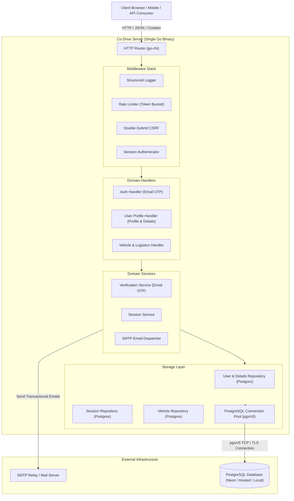

# System Architecture & Technical Specifications (`docs/Architecture.md`)

> **Repository**: Co-Drive  
> **Status**: Production Reference Architecture  
> **Classification**: Core Architectural Specification

---

## 1. High-Level System Topology

Co-Drive is designed as a high-performance Go application with provider-agnostic PostgreSQL connectivity, supporting hosted providers like Neon and Supabase as well as local PostgreSQL setups.

---

## 2. Core Architectural Pillars

### 2.1 Pure-Go PostgreSQL via `pgx/v5`
- **Engine**: `github.com/jackc/pgx/v5/stdlib` (100% Pure-Go, zero CGO toolchain dependency).
- **Concurrency & Pooling**: Configured with production connection pooling:
  - `MaxOpenConns`: 25
  - `MaxIdleConns`: 5
  - `ConnMaxLifetime`: 15 minutes
  - `ConnMaxIdleTime`: 5 minutes
- **Native Data Types**: Leverages PostgreSQL `BOOLEAN`, `TIMESTAMPTZ`, `DOUBLE PRECISION`, and foreign key cascade semantics.

### 2.2 Provider Independence via `DATABASE_URL`
- **Any Standard PostgreSQL**: Seamlessly connects to Neon (serverless branchable Postgres with SSL), Supabase, AWS RDS, GCP Cloud SQL, or local PostgreSQL container/daemon.
- **Single Config Point**: Changing provider requires zero code changes — simply update `DATABASE_URL` in `.env`.

### 2.3 Authentication & Driver Profile Architecture
- **Passwordless Email OTP**: 6-digit numeric OTP, cryptographic SHA-256 token hashing, short TTL (default 10 mins). Pure passwordless authentication eliminates credential theft and password storage risks.
- **Auto-Generated Friendly Names**: First-time OTP verification automatically derives a formatted display name from the email (e.g. `tushar.yadav@example.com` -> `Tushar Yadav`), defaulting to `"Driver"`.
- **Relational Driver Profile (`user_details`)**: Extensible profile attributes (`phone`, `bio`, `address`, `emergency_contact`, `avatar_url`) sit in a dedicated `user_details` relational table linked by `ON DELETE CASCADE`.
- **Rolling Session Layer**: Server-backed PostgreSQL session table with cryptographically random tokens stored in `HttpOnly`, `SameSite=Lax`, `Max-Age=5184000` (60 days) cookies. Sessions automatically renew to a fresh 60 days whenever an active user interacts with $< 30$ days remaining, keeping active users logged in indefinitely.

### 2.4 Sub-Resource Tenant Isolation & Anti-Enumeration
- **Ownership Gate**: The `ownsVehicle(w, r, vehicleID, userID)` method enforces strict tenant boundaries on sub-resource paths (`/api/vehicles/{id}/mileage`, `/api/vehicles/{id}/fuel`, `/api/vehicles/{id}/documents`).
- **Anti-Enumeration Invariant**: If a user attempts to access a vehicle ID owned by another user, the server returns `404 Not Found` (never `403 Forbidden`) to prevent malicious resource enumeration.

### 2.5 In-Memory Metric Derivations
- **Dynamic Derivation**: Efficiency and document expiry statuses are calculated in memory upon query hydration (`ApplyDerived(time.Now())`), avoiding stale database materialized fields.

---

## 3. Package & Module Boundaries

| Package | Path | Responsibility & Boundary Constraints |
| :--- | :--- | :--- |
| `main` | `cmd/server/` | Dependency injection, lifecycle management, graceful shutdown. |
| `migrate` | `cmd/migrate/` | Standalone CLI for running database migrations up/down against PostgreSQL. |
| `auth` | `internal/auth/` | Authentication services, Email OTP verification, rate limiting, and session management. |
| `session` | `internal/session/` | Context-based session extraction and HTTP auth assertions. |
| `users` | `internal/users/` | User and UserDetails models, PostgreSQL repository, and profile endpoints (`GET/PUT /api/users/me`). |
| `vehicles` | `internal/vehicles/` | Vehicle fleet models, logs, derived calculations, and handlers. |
| `middleware` | `internal/middleware/` | Reusable HTTP middlewares (Auth, CSRF, Logging, Rate Limiting). |
| `config` | `config/` | Strongly-typed YAML configuration loader with centralized environment variable overrides. |
| `database` | `pkg/database/` | PostgreSQL driver initializers, connection pool, and embedded migration runner. |
| `email` | `pkg/email/` | SMTP transactional email client with HTML templates. |
| `response` | `pkg/response/` | Standardized JSON envelope response utilities (`response.JSON`, `response.Error`). |

---

## 4. Architectural Invariants

1. **Zero CGO Dependency**: All Go code and third-party dependencies must compile cleanly with `CGO_ENABLED=0`.
2. **Strict Response Envelope**: All API endpoints return consistent JSON envelopes via `pkg/response`.
3. **Cascade Deletes**: Deleting a User cascades to their vehicles and sessions; deleting a Vehicle cascades to its mileage logs and documents.
4. **Environment Isolation**: Environment variables are accessed exclusively in `config/config.go`.
